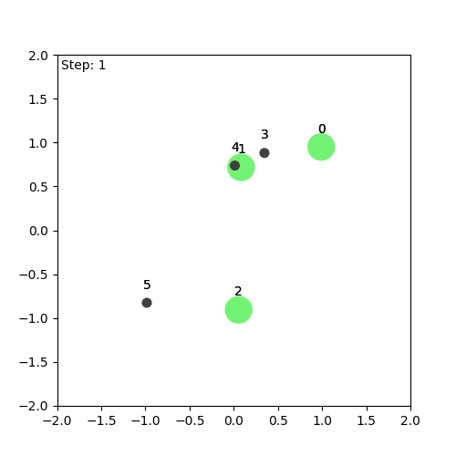
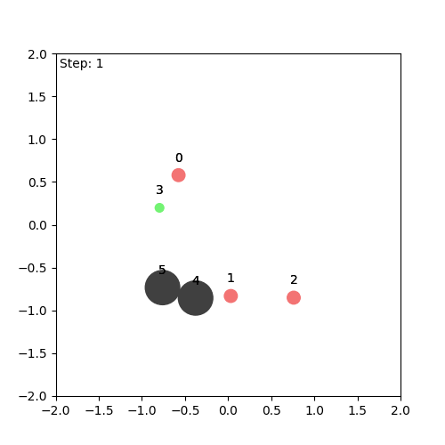
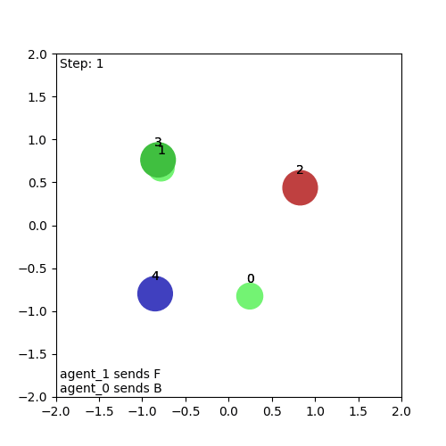
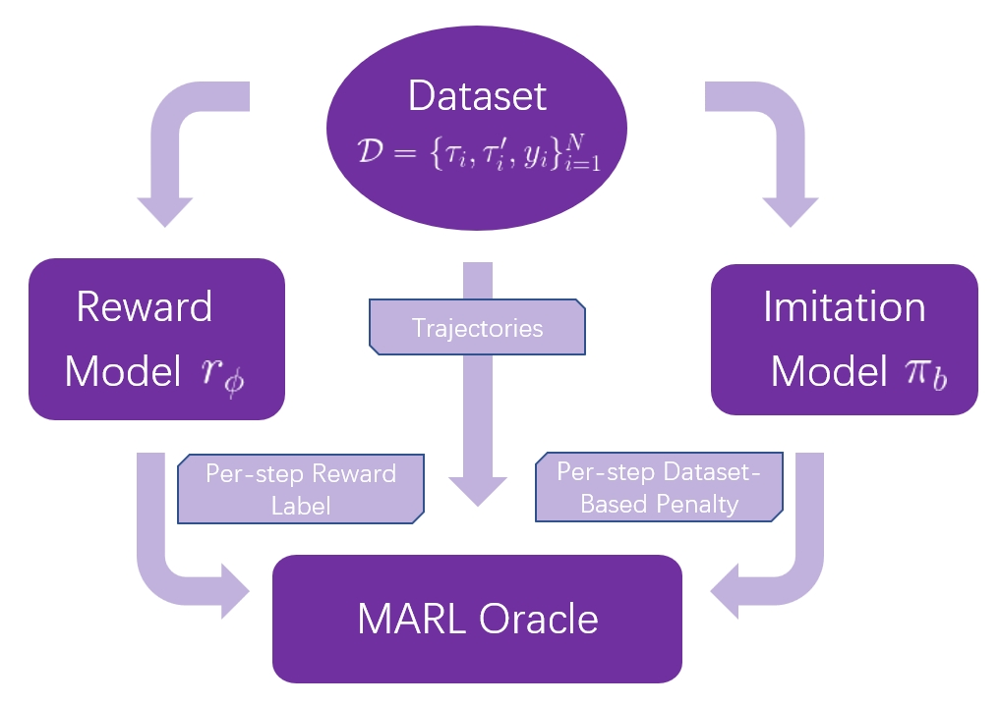

## MARLHF Experiments

<div align="center"> 
     
     
     
</div>

### Introduction
This repository contains the code for the experiments described in the paper "Multi-agent Reinforcement Learning from Human Feedback: Data Coverage and Algorithmic Techniques". In this work, we propose a framework and novel methods for Multi-agent Reinforcement Learning from Human Feedback (MARLHF).

Our method is evaluated on three tasks—Tag, Spread, and Reference—within the [MPE environment](https://github.com/openai/multiagent-particle-envs). Agents are trained using human feedback in the form of offline reward models and imitation learning.

<div align="center">  </div>

### Environment Setup
Our Environment is based on [JaxMARL](https://github.com/FLAIROx/JaxMARL). Before running the experiments, please make sure you have the correct [JAX version](https://github.com/google/jax#installation). Install it via PyPi:

```
pip install jaxmarl 
```

To run our test scripts, you also need to install the following dependencies, and add the project root directory to your PYTHONPATH:
```
pip install -r requirements/requirements-dev.txt 
export PYTHONPATH=$PYTHONPATH:/path/to/your/MARLHF
```

We use Wandb for logging the training process. To log data, set the `WANDB_API_KEY` environment variable and update the `ENTITY` and `WANDB_PROJECT` fields in the training scripts to your Wandb account details.

### Dataset Collection
We've already collected the agent models for the experiments in `MARLHF/model` directory. The next step is to collect trajectories from the models and store them in `MARLHF/data` directory. Run the following commands:
```
cd MARLHF
bash scripts/collect_vdn.sh
bash scripts/collect_vdn_unilateral.sh
```

### Training
To train the models, run the following commands:
```
cd MARLHF
bash scripts/train_all_tag.sh
bash scripts/train_all_spread.sh
bash scripts/train_all_reference.sh
```

Before running the training scripts, you may modify the hyperparameters in the scripts or the default hyperparameters in `MARLHF/train/config/` directory. 

The training process includes automatic training of offline reward models, imitation models, and MARLHF agents. 
The training logs will be stored in the `outputs` and `wandb` directory. 
